# DueVault AI 🚀

**DueVault AI** is a privacy-first, fully localized AI productivity dashboard and engineering workflow engine. Built for developers, students, and power users, it leverages local intelligence to act as a personal project manager—parsing plain text commands and raw HTML schedules into actionable timelines, focus slots, dynamic budgets, and deep-work analytics.

> **Built using Vibe Coding for the Google 5 Days AI Course.**
> 🔒 **100% Client-Side Private:** No databases, no telemetry, no cloud sync. All operations execute directly in your browser using local structures and LocalStorage.

---

## 🛠️ Application Architecture & Workflow

DueVault AI uses a fully local data flow to eliminate context switching, routing tasks, and transaction ledgers to their respective interactive HUD modules.

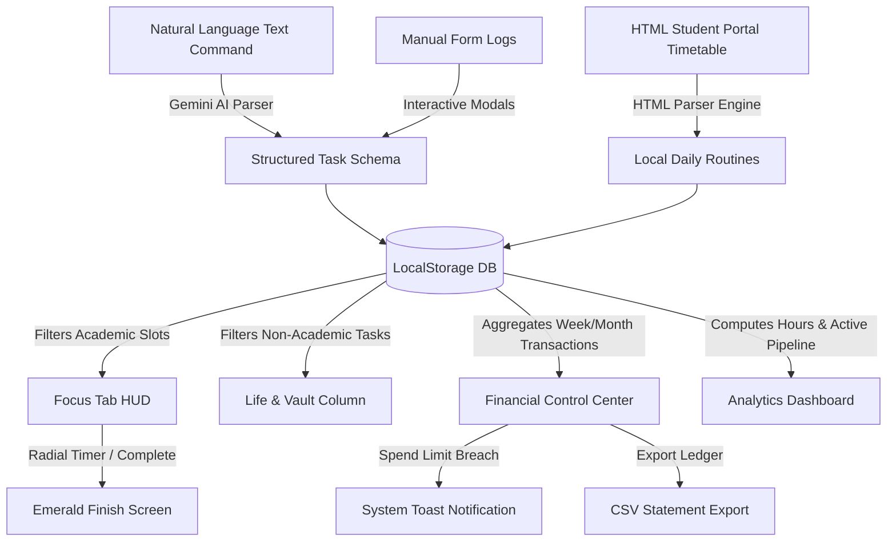

### 1. Unified Processing (The Input Phase)
*   **Natural Language Parsing:** Input phrases like *"Advanced ML Lab tomorrow at 2pm"* are mapped using Gemini into precise JSON schemas containing dates, categories, reminders, and priorities.
*   **HTML Scraping:** Paste raw HTML code directly from university student portals. The system scrapes layout structures, identifies timeslots, and registers recurring routine spawns.

### 2. High-Performance Interfaces (The Execution Phase)
*   **Focus HUD & Timetable:** Academic tasks and routines are lined up sequentially. The active slot controls an immersive countdown clock. When all tasks are completed, the interface transitions to an emerald finish screen.
*   **Strategic Vault Column:** Collates all non-academic reminders, chores, and personal tasks, sorting them into clear action horizons (*This Week*, *Next Week*, *This Month*) with automated cutoff times.

### 3. Financial Control Center
*   **Dynamic Timeframe Switcher:** Toggle between *Current Week*, *Previous Week*, and *Previous Month* to dynamically update total liquid net worth, safe-to-spend estimations, and outflows.
*   **Safe-to-Spend Selector:** Choose whether upcoming bills should be deducted from your safe-to-spend amount immediately or manually, reflecting real-world cash flow control.
*   **Managed Accounts:** Custom account creation with weekly default start baseline resets, toggleable spend limits, warning badges, and automatic notifications on limit breaches.

### 4. Engineering Analytics Dashboard
*   **Horizontal Pipeline:** A draggable scrolling timeline showing upcoming blocks, highlighting the active slot, and flagging overdue unfinished items as `TIME OVER`.
*   **Deep Work Density:** Automatically computes hours logged on technical tasks versus routine overhead.

---

## 🎨 Professional Interface Preview

Toggle between dark and light themes seamlessly. Every interface element is fine-tuned for high contrast, clean aesthetics, and visual comfort.

### 1. Focus HUD & Academic Timeline
*Interactive study slots, countdown timers, and timetable trackers.*
<table>
  <tr>
    <td width="50%"><b>🌙 Dark Mode</b></td>
    <td width="50%"><b>☀️ Light Mode</b></td>
  </tr>
  <tr>
    <td>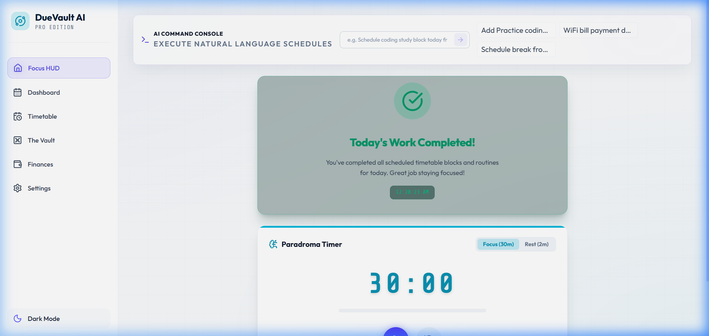</td>
    <td>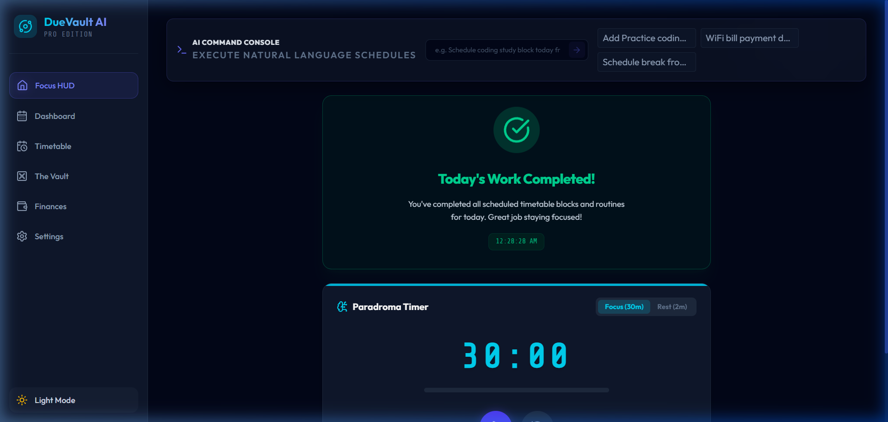</td>
  </tr>
</table>

### 2. Engineering Analytics Dashboard
*Metrics on deep work density, task completions, and draggable timeline.*
<table>
  <tr>
    <td width="50%"><b>🌙 Dark Mode</b></td>
    <td width="50%"><b>☀️ Light Mode</b></td>
  </tr>
  <tr>
    <td>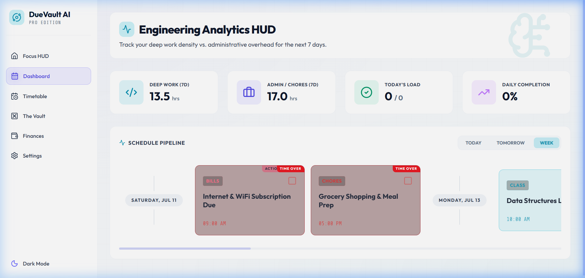</td>
    <td>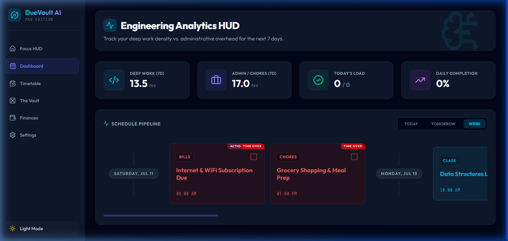</td>
  </tr>
</table>

### 3. Financial Control Center
*Weekly/monthly ledgers, transaction records, safe-to-spend metrics, and account limit warnings.*
<table>
  <tr>
    <td width="50%"><b>🌙 Dark Mode</b></td>
    <td width="50%"><b>☀️ Light Mode</b></td>
  </tr>
  <tr>
    <td>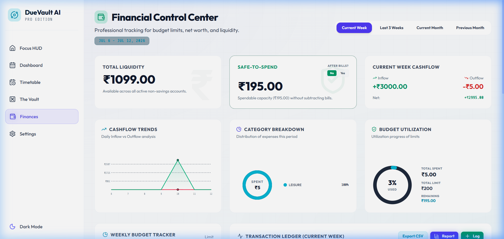</td>
    <td>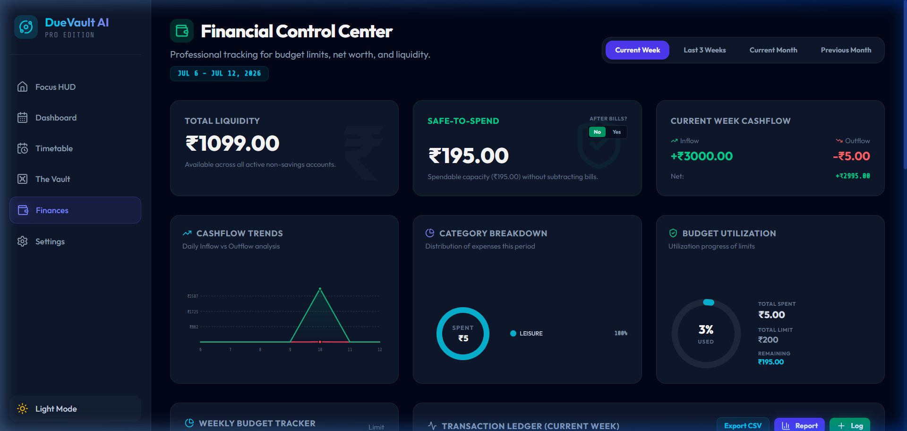</td>
  </tr>
</table>

### 4. The Vault Database
*Task lists grouped by dynamic schedules, archives, and past completed task vault histories.*
<table>
  <tr>
    <td width="50%"><b>🌙 Dark Mode</b></td>
    <td width="50%"><b>☀️ Light Mode</b></td>
  </tr>
  <tr>
    <td>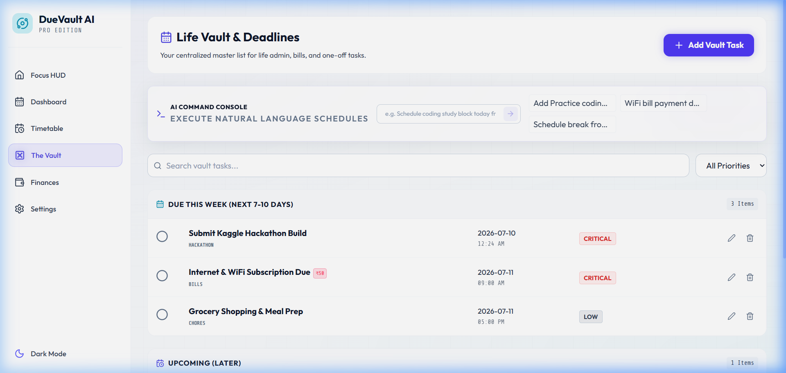</td>
    <td>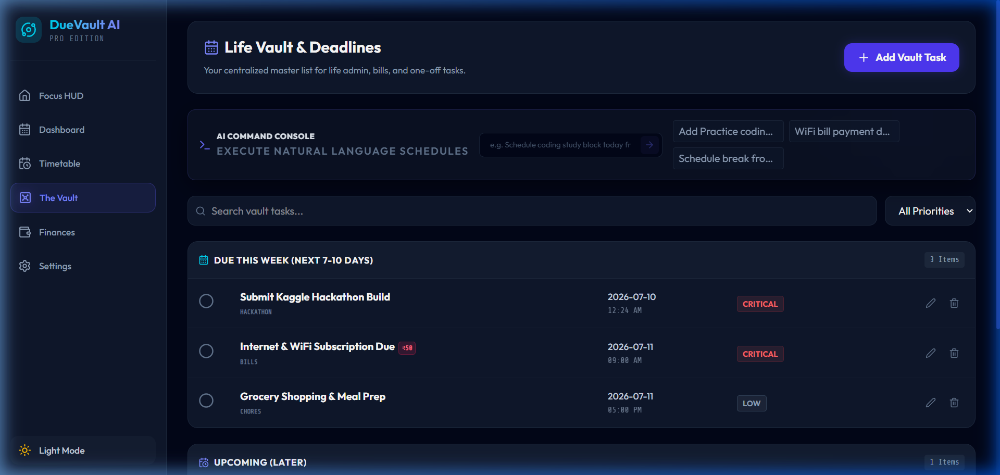</td>
  </tr>
</table>

### 5. AI HTML Timetable Importer
*Scraping raw HTML schedules directly into the local calendar.*
<table>
  <tr>
    <td width="50%"><b>🌙 Dark Mode</b></td>
    <td width="50%"><b>☀️ Light Mode</b></td>
  </tr>
  <tr>
    <td>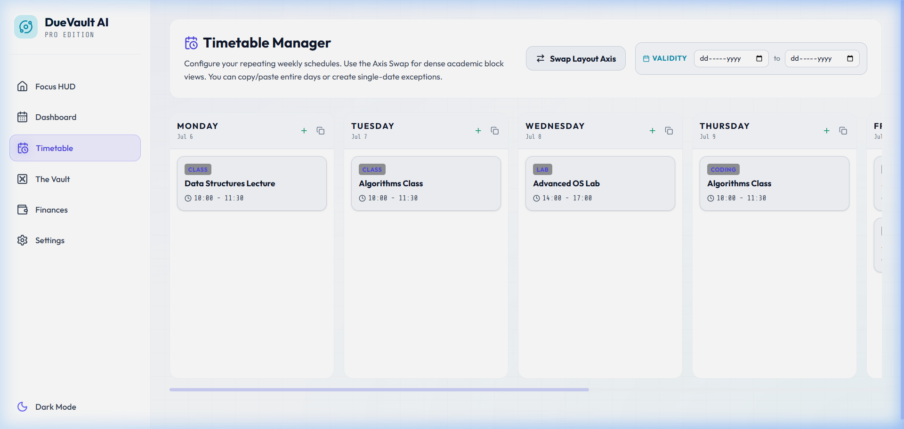</td>
    <td>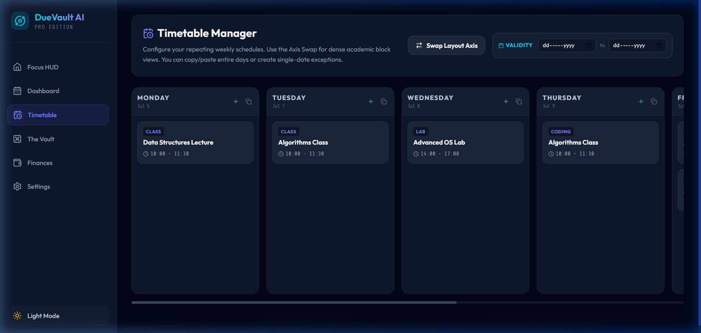</td>
  </tr>
</table>

### 6. Control Panel & Settings
*Manage GPG settings, configure API keys, and stack options dynamically.*
<table>
  <tr>
    <td width="50%"><b>🌙 Dark Mode</b></td>
    <td width="50%"><b>☀️ Light Mode</b></td>
  </tr>
  <tr>
    <td>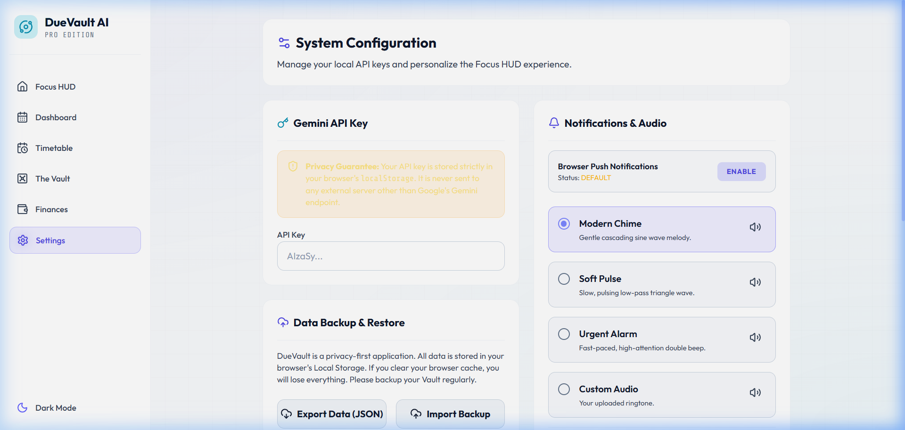</td>
    <td>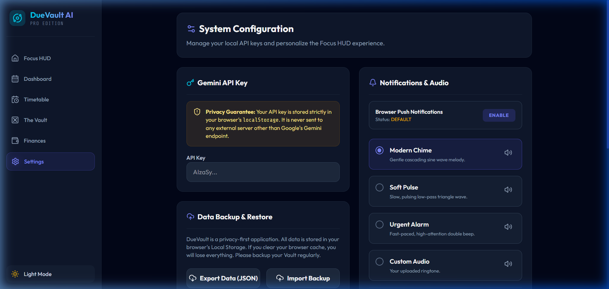</td>
  </tr>
</table>

---

## 💻 Tech Stack

*   **Frontend Engine:** React.js + Vite (built on pure components and standard ES modules)
*   **Styling:** Vanilla CSS Custom Variables (designed dynamically for seamless Light/Dark toggle support) + Tailwind utility layout structures
*   **Icons:** Lucide React
*   **Generative AI:** `@google/genai` (utilizing Gemini models for text commands parsing)
*   **State & Storage:** Persistent client-side LocalStorage DB

---

## 🚀 Getting Started

To run DueVault AI locally on your system:

1.  **Clone the Repository:**
    ```bash
    git clone https://github.com/Prayanshuchourasia-01/DueVault-AI.git
    cd DueVault-AI
    ```

2.  **Install Dependencies:**
    ```bash
    npm install
    ```

3.  **Start Local Hot-Reload Server:**
    ```bash
    npm run dev
    ```

4.  **Configure API Keys:**
    *   Open `http://localhost:5173`.
    *   Navigate to the **Settings ⚙️** view.
    *   Paste your **Gemini API Key** to authorize the natural language parser.
