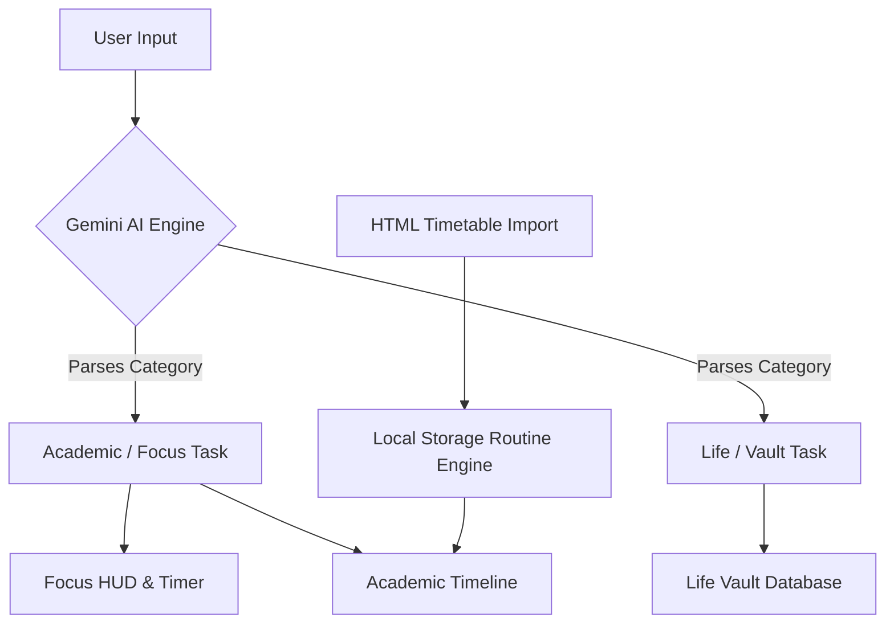

# DueVault AI 🚀


**DueVault AI** is a privacy-first, fully localized AI productivity dashboard and engineering workflow engine. It leverages the power of Gemini to act as your personal project manager—parsing plain text commands and messy HTML schedules into actionable timelines, Pomodoro sessions, and deep-work analytics.

> **Built using Vibe Coding for the Google 5 Days AI Course.**

---

## 🛠️ Application Workflow

DueVault AI is designed to eliminate context switching by routing your tasks intelligently into designated zones.



### 1. The Input Phase
You can interact with DueVault AI in two primary ways:
*   **Natural Language Entry:** Type complex commands like *"I have an advanced AI lab due tomorrow at 4 PM."* The Gemini parser instantly extracts the deadline, duration, category, and priority.
*   **HTML DOM Parsing:** Paste the raw HTML of your university portal schedule. The system crawls the document, identifies recurring patterns, and spawns local daily routines automatically.

### 2. The Execution Phase (Focus HUD)
*   The **Focus HUD** takes your most critical Academic and Engineering tasks and locks them into an immersive, radial countdown timer. 
*   If your active block is "Study," the Pomodoro visualizer pulses. If it's "Life Admin" or a "Wifi Bill," the HUD ignores it so you aren't distracted while coding.

### 3. The Analytics Phase (Engineering Dashboard)
*   As you check off tasks and complete routines, the **Engineering Analytics Dashboard** calculates your Deep Work density versus Administrative Overhead for the next 7 days.
*   Your progress is tracked entirely locally.

---

## 🌟 Key Features

*   **🧠 AI Input Engine:** Instantly parses natural language into rigid JSON schemas.
*   **🕒 Focus HUD & Pomodoro:** A highly visual, dynamic radial timer that hijacks your screen for deep-work blocks. 
*   **📊 Engineering Analytics Dashboard:** Track your daily completion rates and see a live pipeline of your upcoming week.
*   **📅 AI Timetable Import:** Copy and paste messy HTML directly from your university portal to build recurring routines.
*   **🗄️ Life Vault & Finances:** A dedicated master database to track non-academic chores and upcoming bills. 
*   **🔒 Privacy-First Architecture:** No backend databases. No cloud syncing. Everything from your API keys to your personal schedule is stored 100% locally in your browser.

---

## 📸 Screenshots & Previews

<div align="center">
  
  <p><i>The central Focus HUD tracking an active coding session.</i></p>
</div>

*(Note: Add additional screenshot images to `src/assets/` and link them here to flesh out the gallery!)*

---

## 💻 Tech Stack

*   **Frontend Framework:** React + Vite
*   **Styling:** Vanilla CSS & Tailwind CSS for utility wrappers
*   **Icons:** Lucide React
*   **AI Integration:** `@google/genai` (Gemini API)
*   **State Management:** React Hooks + LocalStorage API

---

## 🚀 Getting Started

To run this project locally on your machine:

1. Clone the repository:
   ```bash
   git clone https://github.com/YOUR-USERNAME/duevault-ai.git
   ```
2. Navigate to the project directory:
   ```bash
   cd duevault-ai
   ```
3. Install dependencies:
   ```bash
   npm install
   ```
4. Start the development server:
   ```bash
   npm run dev
   ```
5. Open your browser to `http://localhost:5173`.
6. On first launch, click the **Settings ⚙️** icon and paste your Gemini API Key. It will be securely saved in your browser's local storage.

---

## 🎓 About

This project was rapidly prototyped and developed through **vibe coding** as the capstone project for the **Google 5 Days AI Course**. It demonstrates the power of utilizing LLMs to aggressively structure unstructured data (like conversational text and raw HTML) into highly rigorous, interactive local applications.
