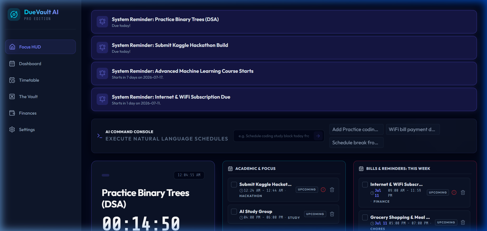
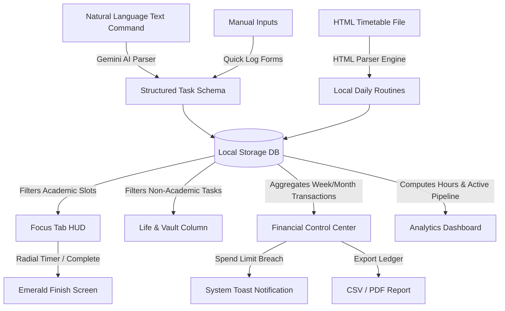
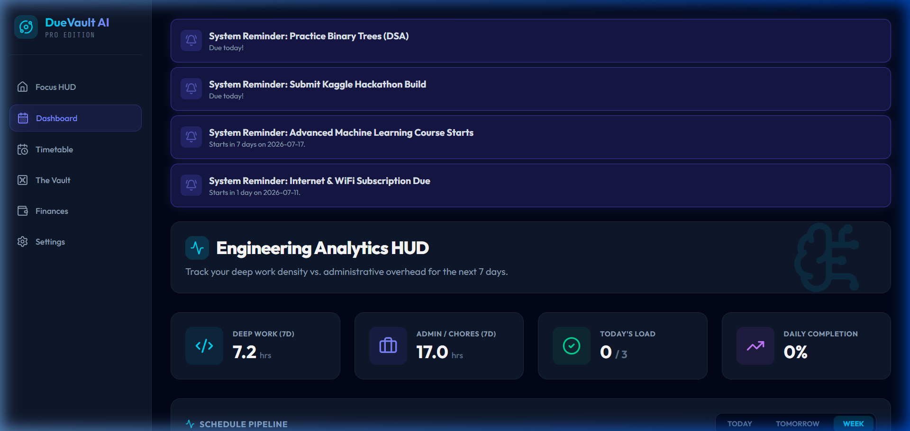
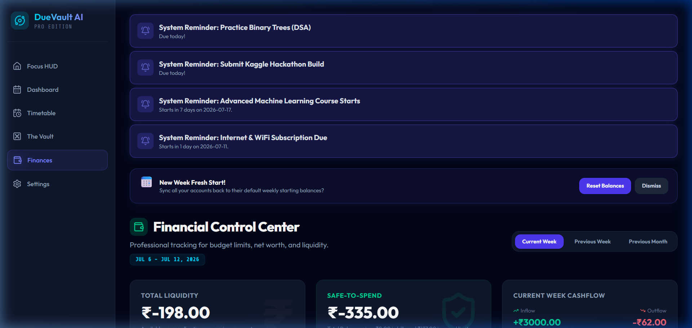
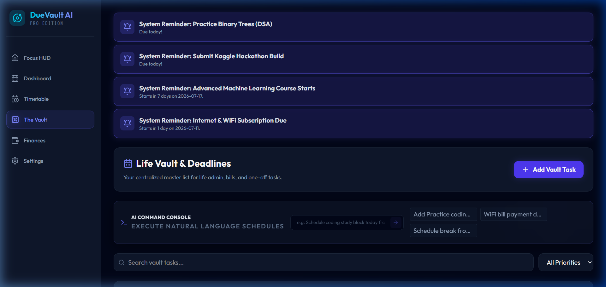
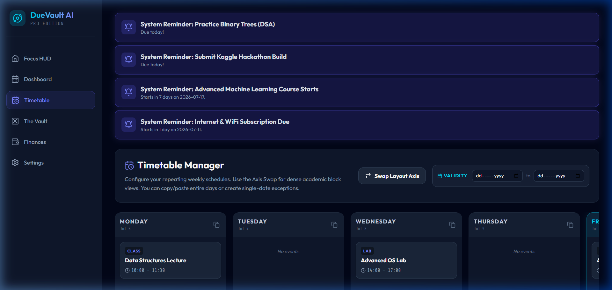

# DueVault AI 🚀



**DueVault AI** is a privacy-first, fully localized AI productivity dashboard and engineering workflow engine. It leverages Gemini to act as a personal project manager—parsing plain text commands and messy HTML schedules into actionable timelines, focus slots, dynamic budgets, and deep-work analytics.

> **Built using Vibe Coding for the Google 5 Days AI Course.**

---

## 🛠️ Application Architecture & Workflow

DueVault AI uses a fully local data flow to eliminate context switching, routing tasks, and transaction ledgers to their respective interactive HUD modules.



### 1. Unified Processing (The Input Phase)
- **Natural Language Parsing:** Input phrases like *"Advanced ML Lab tomorrow at 2pm"* are mapped using Gemini into precise JSON schemas containing dates, categories, reminders, and priorities.
- **HTML Crawling:** Paste raw HTML code directly from your university student portal. The system crawls structure, detects timeslots, and registers recurring routine spawns.

### 2. High-Performance Interfaces (The Execution Phase)
- **Focus HUD & Timetable:** Academic tasks and routines are lined up sequentially. The active slot controls an immersive countdown clock. When all tasks are completed, the interface transitions to an emerald finish screen.
- **Strategic Vault Column:** Collates all non-academic reminders, chores, and personal tasks, sorting them into clear action horizons (*This Week*, *Next Week*, *This Month*) with automated cutoff times.

### 3. Financial Control Center
- **Dynamic Timeframe Switcher:** Toggle between *Current Week*, *Previous Week*, and *Previous Month* to dynamically update total liquid net worth, safe-to-spend estimations, and outflows.
- **Managed Accounts:** Custom account creation with weekly default start baseline resets, toggleable spend limits, warning badges, and automatic notifications on limit breaches.

### 4. Engineering Analytics Dashboard
- **Pipeline Pipeline:** A draggable scrolling timeline showing upcoming blocks, highlighting the active slot, and flagging overdue unfinished items as `TIME OVER`.
- **Deep Work Density:** Automatically computes hours logged on technical tasks versus routine overhead.

---

## 🌟 Key Features

*   **🧠 Gemini AI Input Engine:** Converts messy text entries into JSON schemas.
*   **🕒 Focus HUD & Countdown:** Focus timer tracking study slots.
*   **📊 Draggable Pipeline HUD:** Horizontal interactive timeline scrolling directly to the active task.
*   **📅 AI HTML Importer:** Instantly import student portal tables into clean schedules.
*   **💼 Financial Control Center:** Custom account tracking, week starting resets, and limit breach alerts.
*   **📄 Print/PDF Reports:** Generates professional financial statement reports ready to print or save.
*   **🔒 100% Private & Local:** No cloud sync, no databases, everything runs inside the browser.

---

## 📸 Screenshots & Previews

<div align="center">
  <h3>Focus HUD & Academic Timeline</h3>
  
  <p><i>The Focus HUD tracking your academic tasks alongside dynamic Vault cards.</i></p>

  <br/>

  <h3>Engineering Analytics Dashboard</h3>
  
  <p><i>Draggable timeline displaying ongoing work blocks and Deep Work metrics.</i></p>

  <br/>

  <h3>Financial Control Center</h3>
  
  <p><i>Dynamic week/month timeframe switcher, spend limits tracker, and managed accounts.</i></p>

  <br/>

  <h3>Life Vault & Database</h3>
  
  <p><i>Consolidated vault database showing classified task lists.</i></p>

  <br/>

  <h3>HTML Timetable Parser</h3>
  
  <p><i>Parse raw schedule HTML code directly into recurring routines.</i></p>
</div>

---

## 💻 Tech Stack

*   **Core:** React.js + Vite
*   **Styling:** Vanilla CSS + Tailwind CSS utility wrappers
*   **Icons:** Lucide React
*   **AI Engine:** `@google/genai` (Gemini API)
*   **Database:** Web Storage API (LocalStorage)

---

## 🚀 Getting Started

To run DueVault AI locally on your system:

1. Clone the repository:
   ```bash
   git clone https://github.com/Prayanshuchourasia-01/DueVault-AI.git
   ```
2. Navigate to the directory:
   ```bash
   cd DueVault-AI
   ```
3. Install the dependencies:
   ```bash
   npm install
   ```
4. Start the Vite hot-reloading dev server:
   ```bash
   npm run dev
   ```
5. Open your browser and navigate to `http://localhost:5173`.
6. Open **Settings ⚙️** and save your Gemini API Key to enable natural language parsing.
