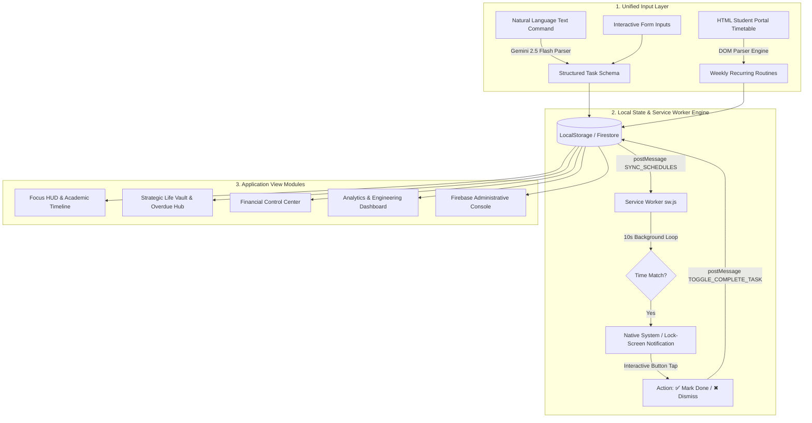

# DueVault AI 🚀

**DueVault AI** is an enterprise-grade, privacy-first, fully responsive PWA (Progressive Web Application), AI productivity dashboard, and strategic lifestyle management engine. Built for power users, students, and engineers, it features offline-first local scheduling, Service Worker background notifications with interactive phone action buttons, financial control ledgers, and multi-user administrative authorization.

> 🏆 **Built for the Google 5 Days AI Course.**  
> 🔒 **100% Private & Environment Safe:** No hardcoded credentials or API keys. All state is maintained locally and via secure environment variables.  
> 📱 **PWA & Mobile Native Ready:** Complete mobile view optimization with background Service Worker execution, lock-screen notification actions, and responsive dark/light themes.

---

## 🏗️ System Architecture & Workflow


```mermaid
flowchart TD
    %% Input Layer
    subgraph Inputs["1. Unified Input Layer"]
        A1[Natural Language Text Command] --> |Gemini 2.5 Flash Parser| B1[Structured Task Schema]
        A2[HTML Student Portal Timetable] --> |DOM Parser Engine| B2[Weekly Recurring Routines]
        A3[Interactive Form Inputs] --> B1
    end

    %% Storage & Service Worker Engine
    subgraph CoreEngine["2. Local State & Service Worker Engine"]
        B1 --> Storage[(LocalStorage / Firestore)]
        B2 --> Storage
        Storage --> |postMessage SYNC_SCHEDULES| SW[Service Worker sw.js]
        SW --> |10s Background Loop| SWCheck{Time Match?}
        SWCheck -->|Yes| PhoneNotif[Native System / Lock-Screen Notification]
        PhoneNotif -->|Interactive Button Tap| ActionMark[Action: ✅ Mark Done / ✖ Dismiss]
        ActionMark -->|postMessage TOGGLE_COMPLETE_TASK| Storage
    end

    %% View Modules
    subgraph Views["3. Application View Modules"]
        Storage --> V1[Focus HUD & Academic Timeline]
        Storage --> V2[Strategic Life Vault & Overdue Hub]
        Storage --> V3[Financial Control Center]
        Storage --> V4[Analytics & Engineering Dashboard]
        Storage --> V5[Firebase Administrative Console]
    end
```

---

## 🌟 Comprehensive Feature Breakdown

### 🔔 1. Service Worker & Background Notification Engine
* **Closed-App Background Execution:** Powered by a custom Service Worker (`public/sw.js`) running a 10-second background evaluation loop. Notifications trigger reliably even when the browser tab or PWA app is completely closed.
* **Interactive Notification Actions:** Direct action buttons in the phone notification drawer:
  * **`✅ Mark Done`** — Completes the timetable block or task directly from your phone's lock screen without opening the browser.
  * **`✖ Dismiss`** — Dismisses the alert notification.
* **Exact-Minute Block Alerts:** Instant `🟢 Block Starting` and `🔴 Block Ended` notifications for all scheduled routine slots.
* **Daily 7:00 AM – 9:00 AM Overdue Alert:** Automatic daily morning push notifications for any uncompleted overdue tasks or pending bills.
* **Synthesizer & Audio Alarms:** Built-in Web Audio API sound generator supporting multiple ringtones (*Modern Chime*, *Soft Pulse*, *Urgent Alarm*) and custom MP3/WAV uploads.

### 🎯 2. Focus HUD & Academic Timetable
* **3-State Focus HUD:** Intelligently transitions between:
  1. **Active Task / Routine Block** with progress timers and priority tags.
  2. **Upcoming Horizon** when preparing for the next scheduled block.
  3. **All Work Completed** screen upon finishing daily routines.
* **Academic & Focus Section:** Displays the next 3 timetable routine blocks sorted chronologically based on current time.
* **Pomodoro Focus Timer:** Customizable work/rest focus intervals with chime alerts and browser notification sync.

### 🏦 3. Strategic Life Vault & Overdue Hub
* **🚨 Overdue & Pending Action Section:** Highlighted warning section for past-due tasks, unpaid bills, and missed deadlines.
* **📅 Categorized Horizons:** Organizes items into *Overdue*, *Due This Week*, *Upcoming (Later)*, and *Completed Vault History*.
* **Real-World Summary Metrics:** Stat cards displaying overdue item count, upcoming week volume, total unpaid bills (`₹`), and completed task metrics.

### 💳 4. Financial Control Center
* **Safe-to-Spend Calculator:** Dynamically computes available liquid cash reserves after accounting for upcoming bills and account limits.
* **Managed Accounts & Limits:** Multi-account tracking with weekly start baselines, toggleable spending limits, and automated warning notifications.
* **Ledger Portability:** Complete JSON/CSV statement export and backup restoration tools.

### 🔐 5. Firebase Auth & Administrative Console
* **Multi-User Security Profile:** Firebase Authentication integration with user approval lifecycle (*PENDING* vs *APPROVED*).
* **Admin Console:** Dedicated administrative dashboard for user role management, instant profile approval, and system auditing.

### 🤖 6. AI Natural Language & HTML Schedule Importer
* **Gemini AI Natural Language Parser:** Converts text prompts like *"Physics Exam tomorrow at 3pm"* into structured JSON tasks using `@google/genai`.
* **HTML Portal Importer:** Scrapes raw HTML timetable tables pasted from student web portals into recurring weekly routines.

---

## 🔒 Security & Privacy Audit

DueVault AI is built with privacy-by-design:
* **No Hardcoded Credentials:** 0 API keys, passwords, or personal emails are committed to the codebase.
* **Environment Variables:** All Firebase configurations utilize Vite `import.meta.env` variables.
* **Local Storage First:** Task databases, financial ledgers, and user preferences reside entirely within the user's browser.

---

## 💻 Tech Stack

* **Frontend:** React.js + Vite (ES Modules)
* **Styling:** Vanilla CSS Custom Variables + Tailwind CSS (Full Dark/Light Theme Support)
* **PWA & Offline Engine:** Service Worker (`sw.js`) with Web Notification API & Web Audio API
* **Backend Services:** Firebase Authentication + Firestore Database
* **Generative AI:** `@google/genai` (Gemini Models for Natural Language Processing)
* **Iconography:** Lucide React

---

## 🚀 Getting Started

### 1. Clone the Repository
```bash
git clone https://github.com/Prayanshuchourasia-01/DueVault-AI.git
cd capstone
```

### 2. Install Dependencies
```bash
npm install
```

### 3. Configure Environment Variables (Optional for Firebase)
Create a `.env` file in the root directory:
```env
VITE_FIREBASE_API_KEY=your_firebase_api_key
VITE_FIREBASE_AUTH_DOMAIN=your_auth_domain.firebaseapp.com
VITE_FIREBASE_PROJECT_ID=your_project_id
VITE_FIREBASE_STORAGE_BUCKET=your_storage_bucket
VITE_FIREBASE_MESSAGING_SENDER_ID=your_sender_id
VITE_FIREBASE_APP_ID=your_app_id
```

### 4. Run Development Server
```bash
npm run dev
```
Open `http://localhost:5173`.

### 5. Build for Production
```bash
npm run build
```

---

## 📱 PWA Mobile Installation

1. Open your deployed DueVault AI URL in **Google Chrome**, **Edge**, or **Safari**.
2. Select **"Add to Home Screen"** or **"Install App"** from the browser menu.
3. Grant notification permissions when prompted to enable background alerts and lock-screen action buttons.

---

## 📄 License

Created for the **Google 5 Days AI Course**. Open-source under the MIT License.
